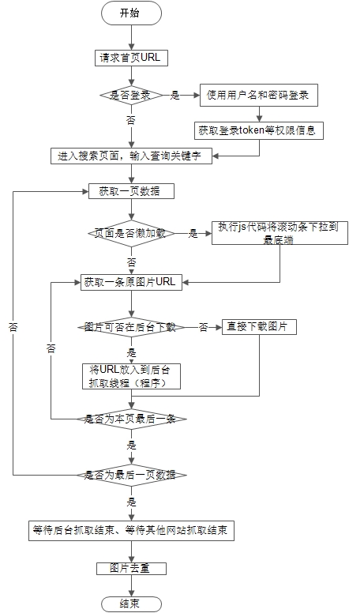

## 项目简介

 

该项目为一个轻量的用于抓取网络上图片数据的爬虫框架

## 设计准则
1. 简单易用
2. 可靠稳定，可靠的网络请求和全面的异常处理机制
3. 高效率
4. 功能较全面

## 目前支持的功能  
1. 模拟浏览器功能，支持动态加载网页数据抓取
2. 多网站可同时多线程下载
3. URL获取与图片下载分离
4. 解决部分反爬虫机制...
5. 支持断点重抓
6. 相同图片去重（比较RGB直方图）
7. 解决很多重复性出现的异常问题
8. <del>模拟登陆功能</del>(由于目前登录模式复杂，登录功能不能完全支持)  

## 系统执行流程图

 

## 依赖
目前本框架主要依赖以下第三方库或应用    

1. BeautifulSoap   
2. Selenuim  
3. requests  
4. Chrome插件

## 使用说明

## 备注
1. 当前仅支持Python3.0
2. logo图片来自网络
